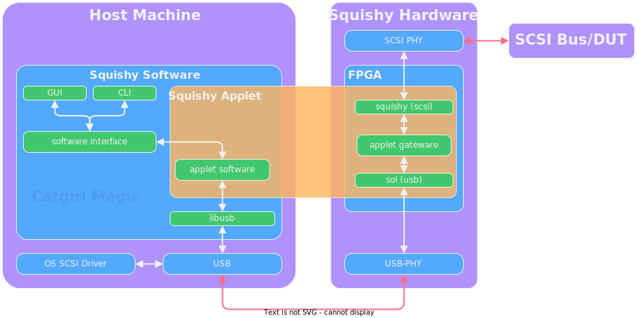

# Introduction

```{todo}
Flesh this section out
```

Squishy is a set of utilities, gateware, and hardware for interacting with and developing things related to SCSI.

Once you've read the sections below and are ready to get started, see the [Installation] and the [Getting Started] sections.


## Overview

Squishy has many moving parts, the following diagram illustrates a rough overview of how
everything in the Squishy system interacts.




## Hardware

The Squishy hardware is a bespoke physical interface into the world of SCSI. Out of the box, it provides a way to inspect and interact with the world of SCSI, be it HVD, LVD, or Single-Ended, all from a modern machine over USB.

Combined with the software, it provides and out-of-the box way of inspecting traffic on a SCSI bus, as well as capturing the traffic for analysis or even replay!

With the power of [Torii], you can also write your own [applets] to do things such as emulate devices, or hosts, or anything else you could imagine.

For more information on the Squishy hardware, see the [Hardware] section in the documentation.

## Software

The Squishy software is a set of utilities that allows for interacting with the Squishy hardware, and a [Python library] that allows for developers of Squishy applets and other applications to parse SCSI traffic and interact with SCSI devices.

For more information on the software, see the [CLI] section as well as the Python library documentation.

## Gateware

The Squishy gateware works in combination with the hardware to allow for the rapid and flexible development of devices that can be used to interact with various SCSI devices.

The [gateware library] allows for applets to be built on the Squishy platform, and for other devices that wish to leverage SCSI in some aspect of their design to do so with [Torii].


For more information, see the [gateware library] documentation.


[Installation]: ./install.md
[Getting Started]: ./getting_started.md
[Torii]: https://github.com/shrine-maiden-heavy-industries/torii-hdl
[applets]: ./applets/index.md
[Hardware]: ./hardware/index.md
[Python library]: ./library/python/index.md
[CLI]: ./cli.md
[gateware library]: ./library/gateware/index.md
